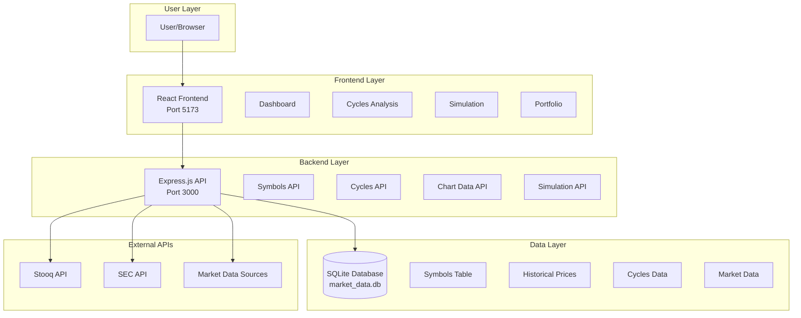
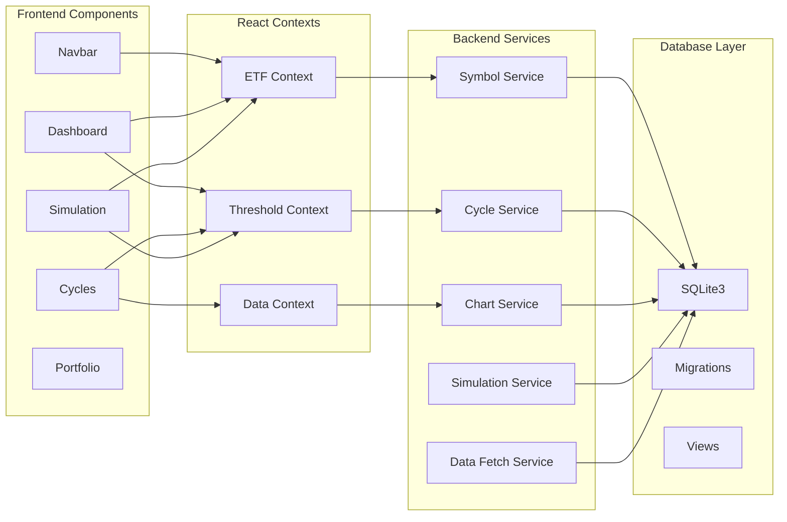
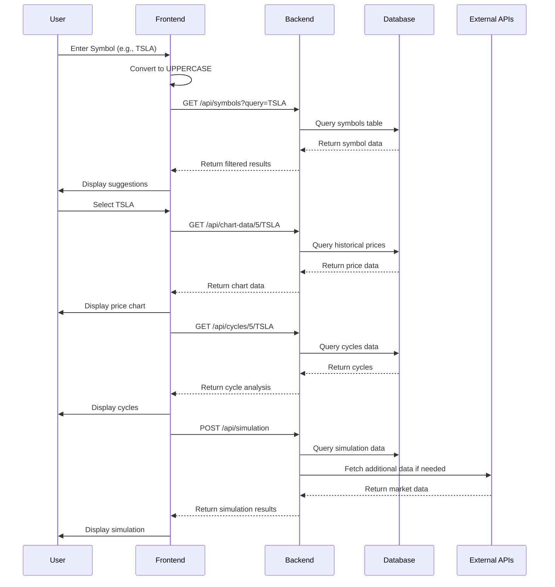
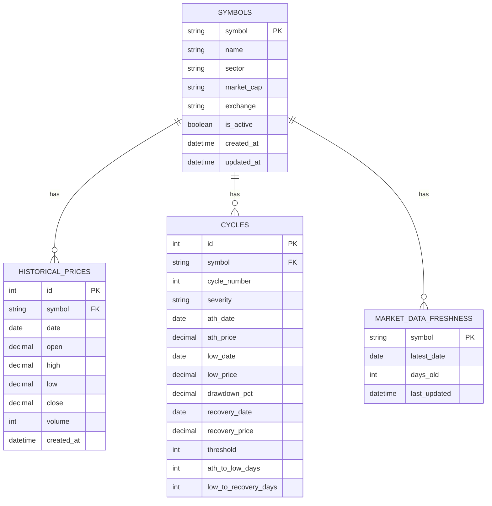
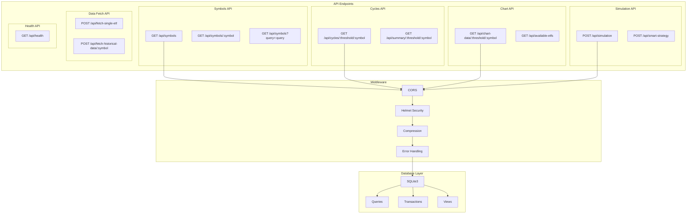
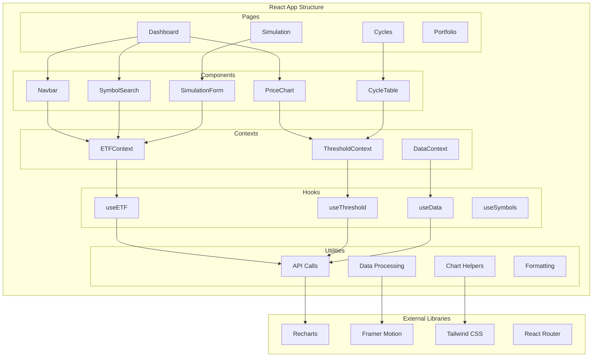
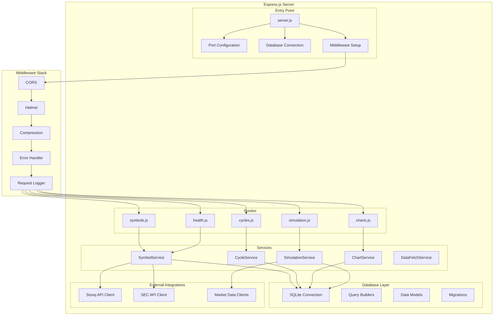
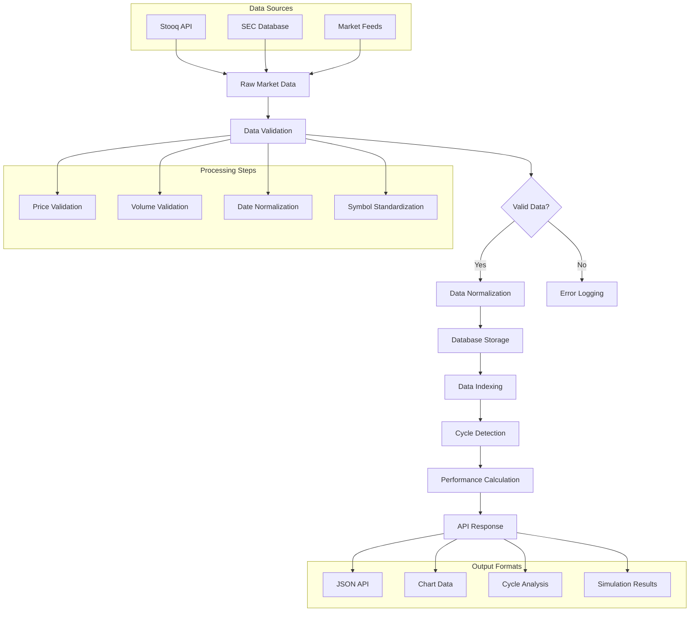
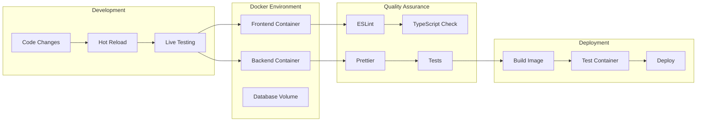

# 🏗️ Stock Market Analysis - Architecture Diagrams

## 📋 **Table of Contents**
1. [System Overview](#system-overview)
2. [Component Architecture](#component-architecture)
3. [Data Flow](#data-flow)
4. [Database Schema](#database-schema)
5. [Deployment Architecture](#deployment-architecture)
6. [API Architecture](#api-architecture)
7. [Frontend Architecture](#frontend-architecture)
8. [Backend Architecture](#backend-architecture)

---

## 🎯 **System Overview**



---

## 🧩 **Component Architecture**



---

## 🔄 **Data Flow**



---

## 🗄️ **Database Schema**



---

## 🐳 **Deployment Architecture**

```mermaid
graph TB
    subgraph "Host Machine (localhost)"
        subgraph "Docker Compose"
            subgraph "Backend Container"
                BC[stock-market-analysis-app<br/>Port 3000:3000]
                BC1[Express.js Server]
                BC2[SQLite Database]
                BC3[Health Checks]
            end
            
            subgraph "Frontend Container"
                FC[stock-market-analysis-dev<br/>Port 5173:5173]
                FC1[Vite Dev Server]
                FC2[React App]
                FC3[Hot Reload]
            end
        end
        
        subgraph "Docker Network"
            DN[stock-market-analysis-network<br/>Bridge Driver]
        end
        
        subgraph "Volumes"
            V1[./database:/app/database]
            V2[./logs:/app/logs]
            V3[.:/app (frontend)]
        end
    end
    
    subgraph "External Access"
        EA1[Browser: localhost:5173]
        EA2[API: localhost:3000]
    end
    
    BC --> DN
    FC --> DN
    BC --> V1
    BC --> V2
    FC --> V3
    EA1 --> FC
    EA2 --> BC
```

---

## 🔌 **API Architecture**



---

## ⚛️ **Frontend Architecture**



---

## 🔧 **Backend Architecture**



---

## 📊 **Data Processing Flow**



---

## 🚀 **Development Workflow**



---

## 📝 **Key Architecture Decisions**

### **1. Containerization Strategy**
- **Docker Compose** for local development
- **Multi-stage builds** for optimized production images
- **Volume mounting** for hot reload and data persistence

### **2. Database Choice**
- **SQLite** for simplicity and portability
- **File-based storage** for easy backup and version control
- **In-memory caching** for performance optimization

### **3. API Design**
- **RESTful endpoints** for consistency
- **JSON responses** for frontend compatibility
- **Error handling** with proper HTTP status codes

### **4. Frontend Architecture**
- **React 18** with modern hooks and patterns
- **Context API** for state management
- **Component composition** for reusability

### **5. Development Experience**
- **Hot reload** for rapid development
- **TypeScript** for type safety
- **ESLint + Prettier** for code quality

---

## 🔍 **Performance Considerations**

### **1. Database Optimization**
- **Indexes** on frequently queried columns
- **Views** for complex queries
- **Connection pooling** for concurrent access

### **2. API Performance**
- **Response caching** for static data
- **Pagination** for large datasets
- **Compression** for response size

### **3. Frontend Performance**
- **Code splitting** for bundle optimization
- **Lazy loading** for components
- **Memoization** for expensive calculations

---

## 🛡️ **Security Considerations**

### **1. Input Validation**
- **Symbol sanitization** to prevent injection
- **Rate limiting** for API endpoints
- **CORS configuration** for cross-origin requests

### **2. Data Protection**
- **SQL parameterization** to prevent injection
- **Input sanitization** for user-provided data
- **Error handling** without information leakage

---

*This document provides a comprehensive overview of the Stock Market Analysis project architecture. Use these diagrams for development planning, system understanding, and team communication.*
