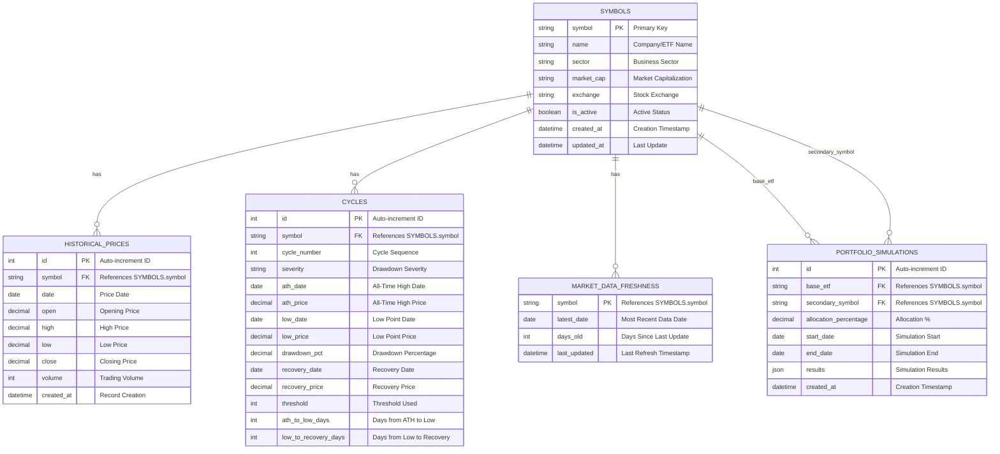
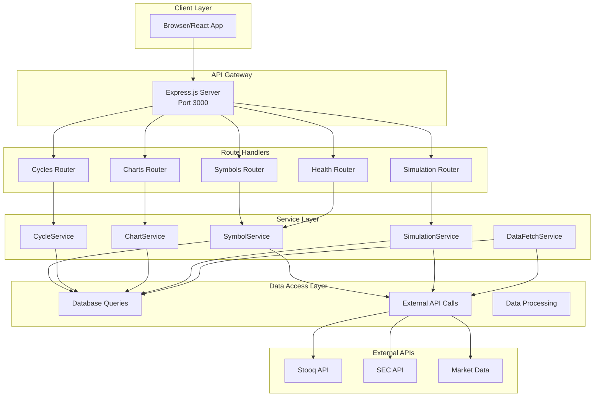
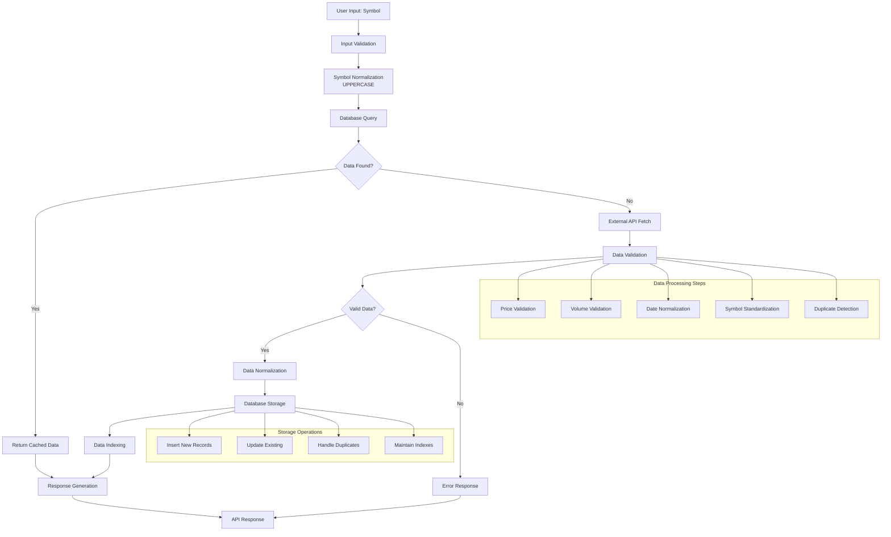
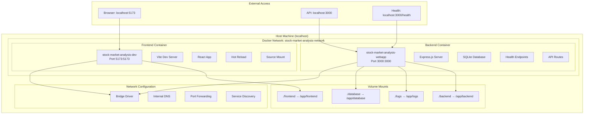
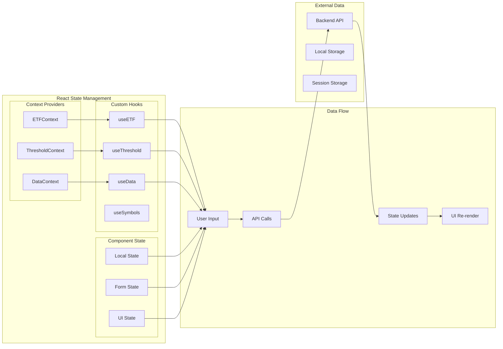
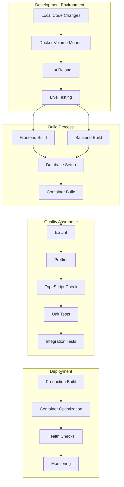

# 🔧 Stock Market Analysis - Technical Architecture

## 🗄️ **Database Schema & Relationships**

## 🔌 **API Endpoint Architecture**

## 📊 **Data Flow & Processing Pipeline**

## 🐳 **Container Architecture & Networking**

## 🔄 **State Management & Data Flow**

## 🛠️ **Development & Build Pipeline**

## 🔍 **Performance & Optimization Architecture**

```mermaid
graph TB
    subgraph "Frontend Performance"
        FP1[Code Splitting]
        FP2[Lazy Loading]
        FP3[Memoization]
        FP4[Virtual Scrolling]
        FP5[Bundle Optimization]
    end
    
    subgraph "Backend Performance"
        BP1[Database Indexing]
        BP2[Query Optimization]
        BP3[Response Caching]
        BP4[Compression]
        BP5[Rate Limiting]
    end
    
    subgraph "Database Performance"
        DP1[Index Strategy]
        DP2[Query Planning]
        DP3[Connection Pooling]
        DP4[Data Partitioning]
        DP5[Cache Layers]
    end
    
    subgraph "Network Performance"
        NP1[CDN Usage]
        NP2[Load Balancing]
        NP3[Compression]
        NP4[HTTP/2]
        NP5[Service Workers]
    end
    
    FP1 --> FP2
    FP2 --> FP3
    FP3 --> FP4
    FP4 --> FP5
    
    BP1 --> BP2
    BP2 --> BP3
    BP3 --> BP4
    BP4 --> BP5
    
    DP1 --> DP2
    DP2 --> DP3
    DP3 --> DP4
    DP4 --> DP5
    
    NP1 --> NP2
    NP2 --> NP3
    NP3 --> NP4
    NP4 --> NP5
```

## 🛡️ **Security & Validation Architecture**

```mermaid
graph TB
    subgraph "Input Security"
        IS1[Symbol Validation]
        IS2[SQL Injection Prevention]
        IS3[XSS Prevention]
        IS4[CSRF Protection]
        IS5[Rate Limiting]
    end
    
    subgraph "Data Security"
        DS1[Parameterized Queries]
        DS2[Input Sanitization]
        DS3[Output Encoding]
        DS4[Access Control]
        DS5[Audit Logging]
    end
    
    subgraph "Network Security"
        NS1[CORS Configuration]
        NS2[Security Headers]
        NS3[HTTPS Enforcement]
        NS4[Firewall Rules]
        NS5[Network Monitoring]
    end
    
    subgraph "Container Security"
        CS1[Image Scanning]
        CS2[Vulnerability Assessment]
        CS3[Resource Limits]
        CS4[Network Isolation]
        CS5[Security Updates]
    end
    
    IS1 --> IS2
    IS2 --> IS3
    IS3 --> IS4
    IS4 --> IS5
    
    DS1 --> DS2
    DS2 --> DS3
    DS3 --> DS4
    DS4 --> DS5
    
    NS1 --> NS2
    NS2 --> NS3
    NS3 --> NS4
    NS4 --> NS5
    
    CS1 --> CS2
    CS2 --> CS3
    CS3 --> CS4
    CS4 --> CS5
```

## 📈 **Monitoring & Observability**

```mermaid
graph TB
    subgraph "Application Monitoring"
        AM1[Performance Metrics]
        AM2[Error Tracking]
        AM3[User Analytics]
        AM4[API Usage]
        AM5[Response Times]
    end
    
    subgraph "Infrastructure Monitoring"
        IM1[Container Health]
        IM2[Resource Usage]
        IM3[Network Status]
        IM4[Disk Space]
        IM5[Memory Usage]
    end
    
    subgraph "Database Monitoring"
        DM1[Query Performance]
        DM2[Connection Status]
        DM3[Storage Usage]
        DM4[Index Usage]
        DM5[Lock Monitoring]
    end
    
    subgraph "Logging & Tracing"
        LT1[Structured Logs]
        LT2[Request Tracing]
        LT3[Error Logging]
        LT4[Performance Logs]
        LT5[Audit Logs]
    end
    
    AM1 --> AM2
    AM2 --> AM3
    AM3 --> AM4
    AM4 --> AM5
    
    IM1 --> IM2
    IM2 --> IM3
    IM3 --> IM4
    IM4 --> IM5
    
    DM1 --> DM2
    DM2 --> DM3
    DM3 --> DM4
    DM4 --> DM5
    
    LT1 --> LT2
    LT2 --> LT3
    LT3 --> LT4
    LT4 --> LT5
```

---

## 📋 **Technical Implementation Details**

### **🔧 Database Implementation**
- **SQLite3** with Node.js bindings
- **Connection pooling** for concurrent access
- **Prepared statements** for security
- **Transaction management** for data integrity
- **Migration system** for schema evolution

### **🌐 API Implementation**
- **Express.js** with middleware stack
- **RESTful design** principles
- **JSON responses** with consistent format
- **Error handling** with proper HTTP codes
- **Request validation** with Joi schemas

### **⚛️ Frontend Implementation**
- **React 18** with modern patterns
- **TypeScript** for type safety
- **Context API** for state management
- **Custom hooks** for logic reuse
- **Component composition** for modularity

### **🐳 Container Implementation**
- **Multi-stage builds** for optimization
- **Volume mounting** for development
- **Health checks** for monitoring
- **Resource limits** for stability
- **Network isolation** for security

---

*This technical architecture document provides detailed implementation specifications for the Stock Market Analysis system. Use this for development planning, system design, and technical decision-making.*
